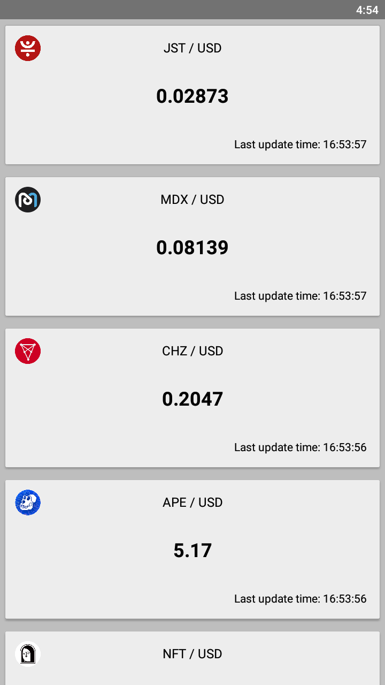
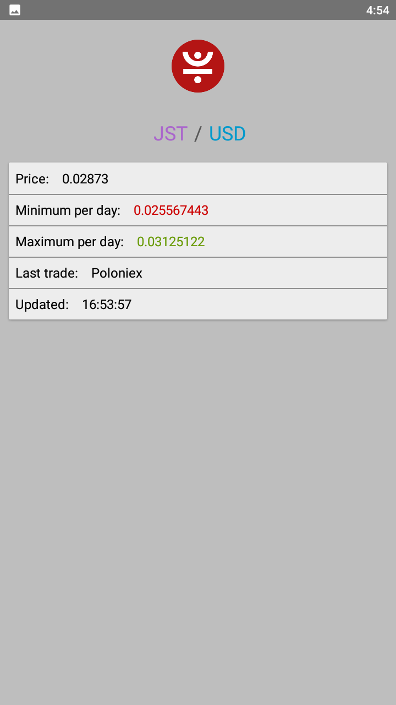
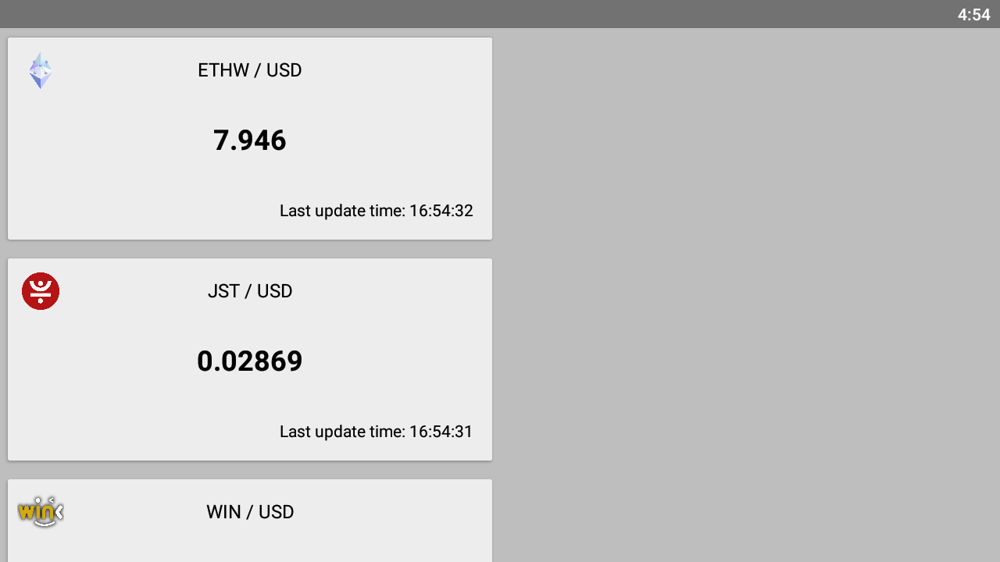
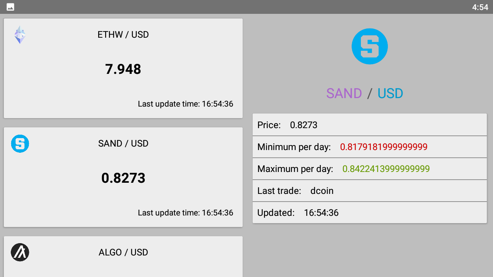

# CryptoApp

## 📜 &nbsp;Description app:

Cryptocurrency exchange rate against the dollar. Requests from cryptocompare.com

## 🛠 &nbsp;Tech Stack

* Kotlin
* MVVM
* XML
* Navigation component with navigation graph
* LiveData
* Kotlin Coroutines
* Kotlin Parcelize
* Recycler View
* Room
* Picasso
* WorkManager
* Retrofit
* Gson

## 📸 &nbsp;Screenshots

 
 
